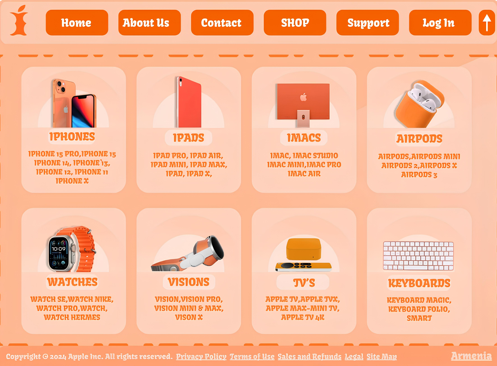
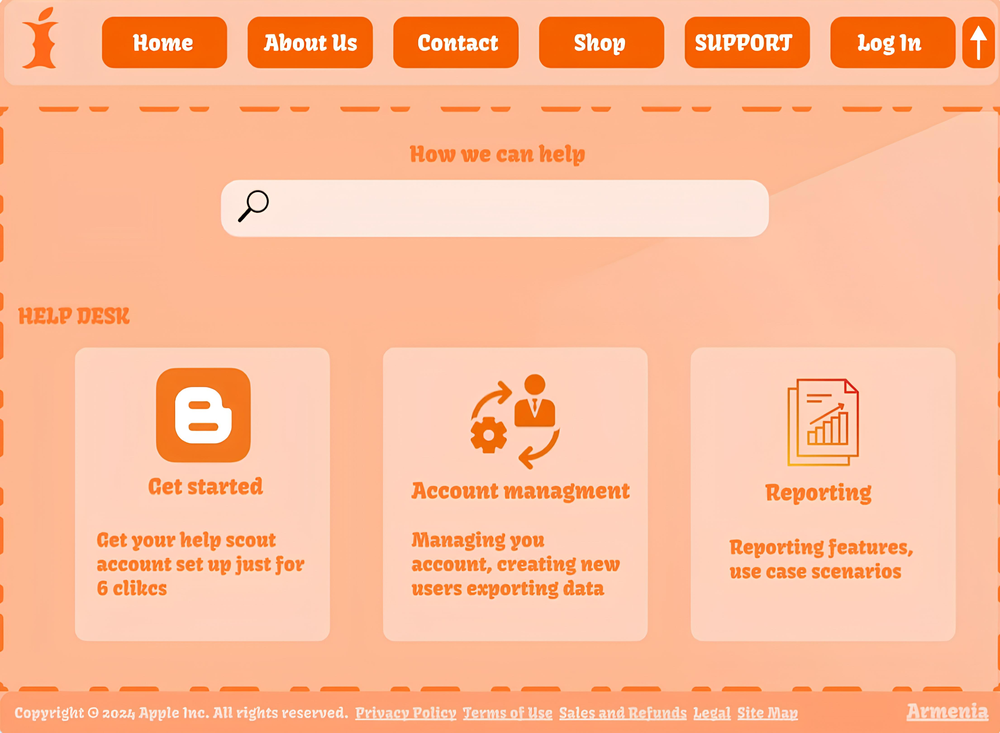
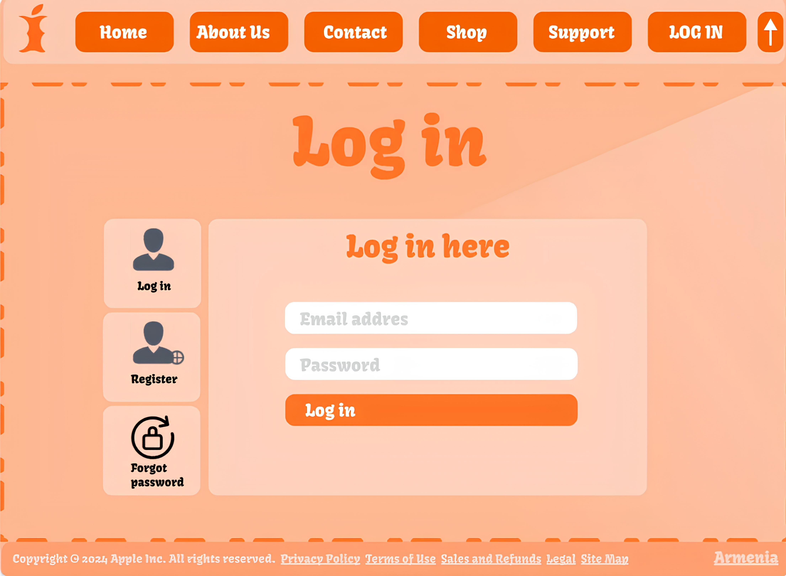

# Artur
# Apple Website Clone

This repository contains a clone of the Apple website, created as a project to practice HTML, CSS, and possibly JavaScript skills. The project aims to replicate the design and functionality of the official Apple website as closely as possible.

## Screenshots

Here are some screenshots of the cloned website:

1. Home Page
   .jpg)

2. Products Page
   

3. Support Page
   

4. Log in Page
   

## Usage

To view the website, simply clone this repository to your local machine and open the `index.html` file in your preferred web browser.

```bash
git clone https://github.com/Artur/apple-website-clone.git
```

## Features

- Responsive design for various screen sizes.
- Navigation bar with dropdown menus.
- Sections for different product categories.
- Detailed product pages.
- Support and contact information.
- About Apple section.

## Technologies Used

- HTML
- CSS

## Contributing

Contributions are welcome! If you'd like to contribute to this project, feel free to open a pull request. Please ensure that your code follows the existing coding style and conventions.

## License

This project is licensed under the MIT License - see the [LICENSE](LICENSE) file for details.

---

Feel free to reach out if you have any questions or suggestions regarding this project. Happy coding! 🍏
